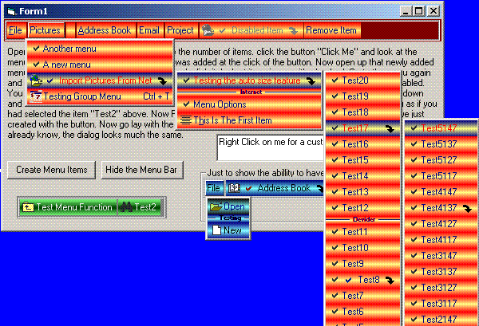



## Menu Bar

### Description

'Welcome to The new and improved Menu Control.

'Created By Russell Sanders 12/2006

'

2/21/07

I said in the last update that it would be the last but I have fixed a few things that just had to be published. After all the time I put in to the code I left out something as simple as, changing the caption on the fly, out. So I fixed that and also got the tool tips working. a few other small things.

' In the past two months I have put close to 300 hours in this control. I thank you all for looking

'	at it and welcome any comment good or bad.

' This works well for small apps.

'

'credits:

' PSC for a place to get help and code on anything. And to all the dedicated users of PSC

' who post there thoughts there advice and criticisms on code, Thanks.

' other credits are with the relative code.

'

' This uses Pauls' safe subclass Code Found At:

' http://www.Planet-Source-Code.com/vb/scripts/ShowCode.asp?txtCodeId=42918&amp;lngWId=1

'

read the readme in the zip to understand usage.

read the code to see how

Update:2-14-2007

this will be the last update for this control. Unless I find a bad problem with it. I have started to work on an MDI version of this control and will be replacing this one with it when it is done.
 
### More Info
 

             |
---                |---
**Submitted On**   |2007-02-21 14:43:22
**By**             |[Russell Sanders](https://github.com/Planet-Source-Code/PSCIndex/blob/master/ByAuthor/russell-sanders.md)
**Level**          |Beginner
**User Rating**    |5.0 (25 globes from 5 users)
**Compatibility**  |VB 6\.0
**Category**       |[Custom Controls/ Forms/  Menus](https://github.com/Planet-Source-Code/PSCIndex/blob/master/ByCategory/custom-controls-forms-menus__1-4.md)
**World**          |[Visual Basic](https://github.com/Planet-Source-Code/PSCIndex/blob/master/ByWorld/visual-basic.md)
**Archive File**   |[Menu\_Bar2049252212007\.zip](https://github.com/Planet-Source-Code/russell-sanders-menu-bar__1-67815/archive/master.zip)

